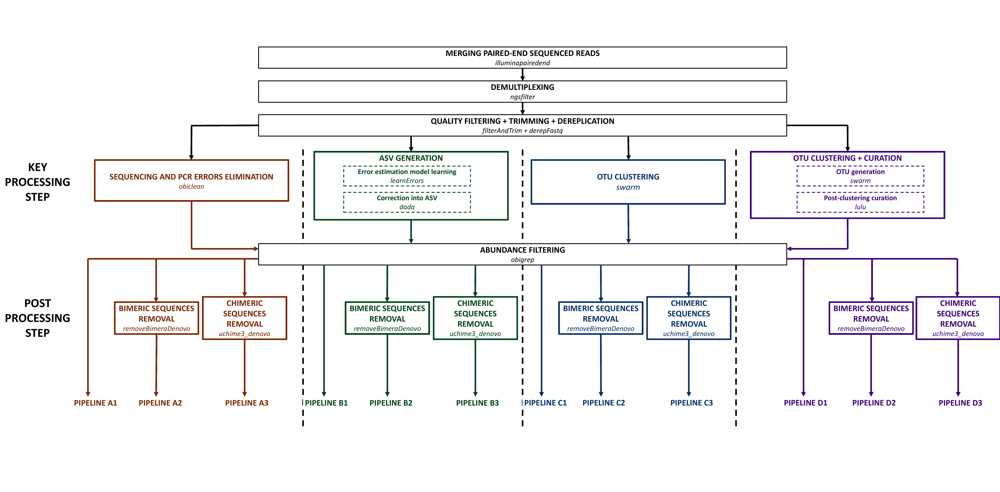

# eDNA_intra_pipeline_comparison

**Bastien Macé, 2021**

_________________________________


# Table of contents

  * [I - Introduction](#intro)
  * [II - Installation](#install)
    + [Preliminary steps for OBITools](#preliminary-steps-for-obitools)
    + [Preliminary steps for DADA2](#preliminary-steps-for-dada2)
    + [Preliminary steps for SWARM](#preliminary-steps-for-swarm)
    + [Preliminary steps for LULU](#preliminary-steps-for-lulu)
    + [Preliminary steps for VSEARCH](#preliminary-steps-for-vsearch)
  * [III - Pre-processing steps](#step1)
  * [IV - Key processing steps](#step2)
    + [IV - 1 - OBITOOLS processing step (Pipelines A)](#step21)
    + [IV - 2 - DADA2 processing step (Pipelines B)](#step22)
    + [IV - 3 - SWARM processing step (Pipelines C)](#step23)
    + [IV - 4 - SWARM + LULU processing step (Pipelines D)](#step24)
  * [V - Abundance filtering step](#step3)  
  * [VI - Post-processing steps](#step4)
    + [VI - 1 - No post-processing step (Pipelines A1/B1/C1/D1)](#step41)
    + [VI - 2 - Bimeric sequences removal (Pipelines A2/B2/C2/D2)](#step42)
    + [VI - 3 - Chimeric sequences removal (Pipelines A3/B3/C3/D3)](#step43)
  * [VII - Analyse your results](#step5)

_________________________________

<a name="intro"></a>
## I - Introduction

This project aims to compare twelve bioinformatics pipelines based on five existing metabarcoding programs to make recommendations for data management in intraspecific variability studies using environmental DNA.

Data processing is necessary in metabarcoding studies to eliminate false sequences which are generated during amplification and sequencing, and particularly for intraspecific studies from eDNA samples, where the presence of false sequences in the data can over-estimate the intraspecific genetic variability.
That is why there is a need in filtering sequences with bioinformatics pipelines. Different bioinformatics tools have been developped for metabarcoding studies. Here, we propose to compare some of them, by building twelve unique pipelines.

For that, we use the following programs :

- [OBITOOLS](https://git.metabarcoding.org/obitools/obitools/wikis/home) : a set of commands written in python
- [DADA2](https://benjjneb.github.io/dada2/index.html) : a R package
- [SWARM](https://github.com/torognes/swarm) : a command written in C++
- [LULU](https://github.com/tobiasgf/lulu) : a R package
- [VSEARCH](https://github.com/torognes/vsearch) : a set of commands written in C++

The following figure summarizes the twelve pipelines compared in our study :



In our study, we analyze the results of a paired-end sequencing, after extraction and amplification of filtrated eDNA from aquarium seawater, to detect intraspecific haplotypic variability in *Mullus surmuletus*. Only one aquarium is given as example in the scripts.

<a name="install"></a>
## II - Installation

### Preliminary steps for OBITools

You need to have Anaconda installed. If it's not the case, click on this [link](https://www.anaconda.com/products/individual/get-started) and download it. Install the download in your shell, close your shell and reopen it.

Verify conda is correctly installed. It should be here :
```
~/anaconda3/bin/conda
```

Write the following line :
```
conda config --set auto_activate_base false
```

Then, create your new environment obitools from your root in your corresponding path. For example :
```
ENVYAML=./dada2_and_obitools/obitools_env_conda.yaml
conda env create -f $ENVYAML
```

Now you can activate your environment before starting OBITOOLS commands :
```
conda activate obitools
```

And deactivate it :
```
conda deactivate
```
### Preliminary steps for DADA2

You need to have a recent R version (3.6.2 minimum). If it's not the case, click on this [link](hhttps://cran.r-project.org/) and download it.

Then, open your IDE (RStudio for example), and install the package :
```
install.packages("dada2")
```

### Preliminary steps for SWARM

Get the compressed folder on the [creator GitHub](https://github.com/torognes/swarm) in your downloads folder and install it :
```
git clone https://github.com/torognes/swarm.git
cd swarm/
make
```

### Preliminary steps for LULU

Open your IDE for R (RStudio for example), and install the package :
```
install.packages("lulu")
```

### Preliminary steps for VSEARCH

Get the compressed folder on the [creator GitHub](https://github.com/torognes/vsearch) in your downloads folder and install it :
```
git clone https://github.com/torognes/vsearch.git
cd vsearch
./autogen.sh
./configure
make
sudo make install
```

<a name="step1"></a>
## III - Pre-processing steps

### Merging paired-end sequenced reads (OBITOOLS)

Activate your environment for OBITOOLS in your shell :
```
conda activate obitools
```

Use the command _illuminapairedend_ to make the paired-end merging from the forward and reverse strands of the sequences you have in your data. The command aligns the complementary strands in order to get a longer sequence. In fact, after PCR, the last bases are rarely correctly sequenced. So having the forward and the reverse strands allows to lenghten the sequence, thanks to the beginning of the reverse strand, which is usually correctly sequenced.
```
illuminapairedend --score-min=40 -r mullus_surmuletus_data/Aquarium_2_F.fastq mullus_surmuletus_data/Aquarium_2_R.fastq > Aquarium_2.fastq
# a new .fastq file is created, it contains the sequences after the merging of forward and reverse strands
# alignments which have a quality score higher than 40 (-- score-min=40) are merged and annotated "aligned", while alignemnts with a lower quality score are concatenated and annotated "joined"
```

To only conserve the sequences which have been merged, use _obigrep_ :
```
obigrep -p 'mode!="joined"' Aquarium_2.fastq > Aquarium_2.ali.fastq
# -p requires a python expression
# python creates a new dataset (.ali.fastq) which only contains the sequences annotated "aligned"
```

### Demultiplexing (OBITOOLS)

A _.txt_ file assigns each sequence to its sample thanks to its tag, because each tag corresponds to a reverse or a forward sequence from a sample.

To compare the sequences next, you need to remove the tags and the primers, by using the _ngsfilter_ command :
```
ngsfilter -t mullus_surmuletus_data/Med_corr_tags.txt -u Aquarium_2.unidentified.fastq Aquarium_2.ali.fastq > Aquarium_2.ali.assigned.fastq
# the command creates new files :
# ".unidentified.fastq" file contains the sequences that were not assigned whith a correct tag
# ".ali.assigned.fastq" file contains the sequences that were assigned with a correct tag, so they contain only the barcode sequences
```

Then, separate your _.ali.assigned.fastq_ files depending on their samples in placing them in a dedicated folder (useful for next steps) :
```
mkdir samples
# creates the folder
mv -t samples Aquarium_2.ali.assigned.fastq
# places the latests ".fastq" files in the folder
cd samples
obisplit -t samples --fastq sample/Aquarium_2.ali.assigned.fastq
# separates the files depending on their samples
mv -t ./dada2_and_obitools Aquarium_2.ali.assigned.fastq
# removes the original files from the folder
```

Now you have as many files as samples, containing demultiplexed sequences.

### Be prepared for DADA2

Quit your shell and open your IDE for R.

First you have to load the dada2 package :
```
library("dada2")
```

Select the files you want to analyze in your path containing your demultiplexed data :
```
fns <- sort(list.files(path, pattern = ".fastq"", full.names = T))
# the function only extracts files that end with the chosen pattern and they are extracted with their whole path
```

And select the part of the files name you want to keep :
```
sample.names <- sapply(strsplit(basename(fns), ".fastq"), '[', 1)
# the function "basename" removes all the path up to the file name
# the function "strsplit" removes the pattern written
```

### Filtering & Trimming (DADA2)

Initiate the creation of a new folder to store the filtered sequences generated :
```
filts <- file.path(path, "filtered", paste0(sample.names, ".filt.fastq.gz"))
# builds the path to the new folder, which will be located in the path already used and which name will be "filtered"
# the files are named as described before with sample.names, and the pattern ".filt.fastq.gz" will be added
```

These files are created after trimming and filtering with different criteria :
```
out <- filterAndTrim(fns, filts,
                     truncLen = 235,
                     maxN = 0,
                     maxEE = 1,
                     compress = T,
                     verbose = T)
# "truncLen" value is chosen considering the marker length and define were the reads will be trimmed (after 235 bp here), and reads which are shortened than this value are filtered
# "maxN" is the number of N tolerated in the sequences after filtering (0 here)
# "maxEE" define the maximal number of expected errors tolerated in a read (1 here), based on the quality score (EE = sum(10^(-Q/10)))
# "compress = T" means that the files will be gzipped
# "verbose = T" means that information concerning the number of sequences after filtering will be given
```

The filtering permits to clean the data to eliminate a large number of unexploitable sequences for our study, and the trimming permits to facilitate the sequence comparison in the next steps.

### Dereplication (DADA2)

Now you can eliminate all the replications of each sequence from the new _.fastq.gz_ files :
```
derep <- derepFastq(filts)
# the function annotates each sequence with his abundance
```

This dereplication will considerably reduce the processing time of the next steps, and no information is lost as the abundance (or read count) of each sequence is now annotated in its header.

<a name="step2"></a>
## IV - Key processing steps

<a name="step21"></a>
### IV - 1 - OBITOOLS processing step (Pipelines A)

The OBITOOLS command used in pipelines A is _obiclean_. This command eliminates punctual errors caused during PCR. The algorithm makes parwise alignments for all the amplicons. It counts the number of dissimilarities between the  amplicons, and calculates the ratio between the abundance of the two amplicons aligned. If there is only 1 dissimilarity (parameter by default, can be modified by the user) and if the ratio is lower than a threshold set by the user, the less abundant amplicon is considered as a variant of the most abundant one.

Sequences which are at the origin of variants without being considered as one are tagged "head". The variants are tagged "internal". The other sequences are tagged "singleton".

By only conserving the sequences tagged "head", most of erroneous sequences are eliminated.

The following line is lanched in a shell, after the R pre-processing steps :
```
obiclean -r 0.05 -H Aquarium_2.fasta > Aquarium_2.clean.fasta
# here, the command only returns only the sequences tagged "head" by the algorithm, and the chosen ratio is 0.05
```

For more details on this OBITOOLS processing step, see the original publication [here](https://doi.org/10.1111/1755-0998.12428).

<a name="step22"></a>
### IV - 2 - DADA2 processing step (Pipelines B)

The DADA2 function used in pipelines B is _learnErrors_. This function is able to distinguish the incorrect sequences from the correct sequences generated during amplification and sequencing, by estimating the sequencing error rate.

To build the error model, the function alternates estimation of the error rate and inference of sample composition until they converge on a jointly consistent solution.

The algorithm calculates the abundance p-value for each sequence. This p-value is defined by a Poisson distribution, with a parameter correspondig to the rate of amplicons of a sequence i generated from a sequence j.

Before that, a partition is built with the most abundant sequence as the core. All the other sequences are compared to this core. The sequence with the smallest p-value is analyzed : if this p-value is inferior than a parameter of the algorithm (OMEGA_A), this sequence become the core of a new partition. The other sequences joins the partition most likely to have produced the core. This operation is repeated until there is no p-value which falls under the parameter OMEGA_A.

Then, all the sequences from a partition are transformed into their core, so each partition corresponds to a unique sequence : the ASV (Amplicon sequence variant).

The following lines are lanched in R following the R pre-processing steps :
```
err <- learnErrors(derep[k], randomize=T)
# builds the error model
dadas <- dada(derep[k], err)
# eliminates the false sequences identified by the model to oncly conserve ASVs
seqtab <- makeSequenceTable(dadas)
# constructs a sequence table with the sequences filtered
uniqueSeqs <- getUniques(seqtab)
uniquesToFasta(uniqueSeqs, paste0("PipelineB_", sample.names[k], ".fasta"))
# creates a new ".fasta" file constaining the ASVs
```

For more details on this DADA2 processing step, see the original publication [here](https://doi.org/10.1038/nmeth.3869).

<a name="step23"></a>
### IV - 3 - SWARM processing step (Pipelines C)

<a name="step24"></a>
### IV - 4 - SWARM + LULU processing step (Pipelines D)